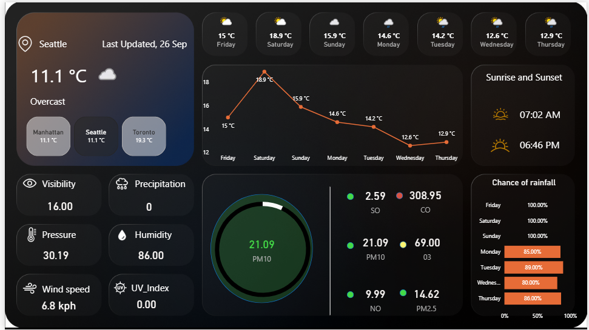

# 🌦️ Weather Dashboard (Power BI)

This repository contains a **Weather Dashboard** built using **Power BI**.  
The dashboard provides interactive insights into weather patterns such as **temperature, humidity, wind speed, rainfall, and air quality** across different cities and time periods.  

---

## 📊 Features
- Interactive visuals for **temperature trends** over time  
- Comparison of **humidity, CO₂, and AQI levels**  
- Dynamic **filters and slicers** for cities and time ranges  
- **Custom visuals** to represent weather conditions  

---

## 🚀 Getting Started

